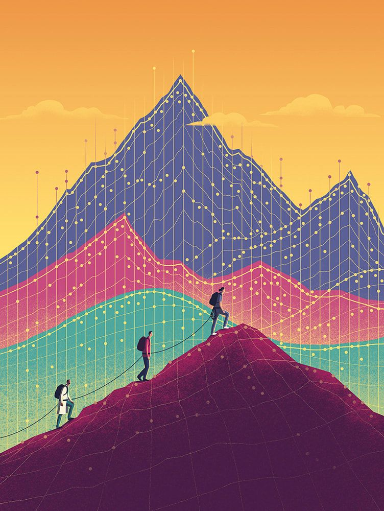

### Hi there👋 I'm Elif Baghirov a Jr. Data Scientist.

### Glad to see you here! &nbsp; 

I am a data scientist who is passionate about building models and using data visualization techniques to solve business problems. I could help you with ecological, communal and human behaviors projects.

**Talking about Personal Stuffs:**

- 🔭 I’m currently working on [Data Science for Public Good Bootcamp-21 ](https://www.kodluyoruz.org/dspg/)
- 🌱 I’m currently learning Data Analysis and Visualization with Python on DataQuest 
If you need discount for registering on Dataquest. You can use [my referral link in DataQuest.](https://app.dataquest.io/referral-signup/d0rg8d1y/)

 

📊 *This Week I Spent My Time On:*
<!--START_SECTION:waka-->
No Activity tracked this Week
<!--END_SECTION:waka-->

📈 *My GitHub Stats:*

  
  

